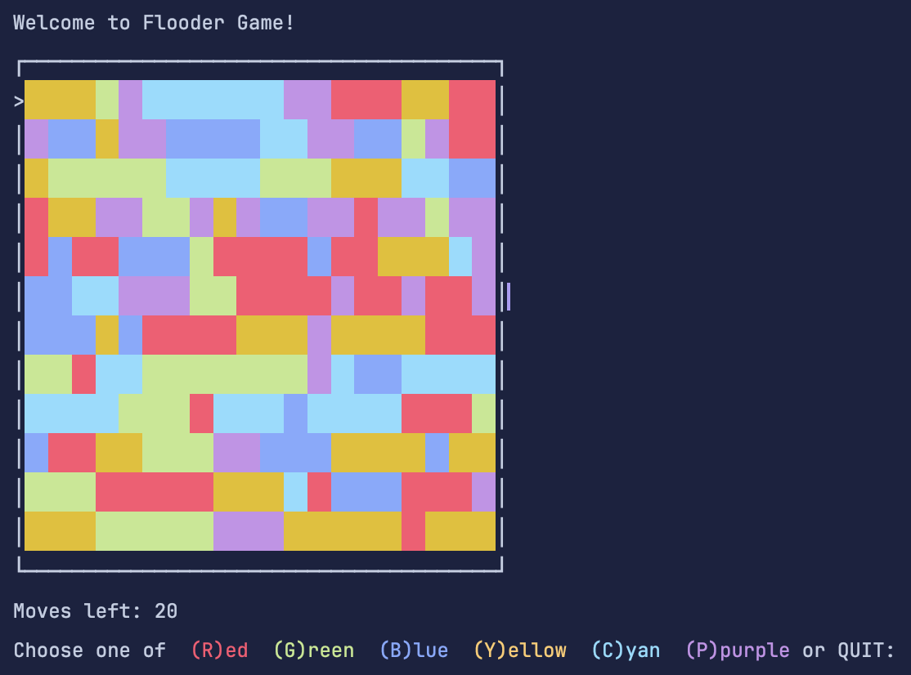

# Flooder

## 📄 Instruction
Flood is a simple yet addictive strategy game in which you have to flood the whole game board with one colour in less than the allowed steps.

### Step
> Step 1 - Get New Board

> Step 2 - Display the Board

> Step 3 - Ask for Player Move

> Step 4 - Check for Win

### 📤 Example Output

Happy Coding! 🚀✨
